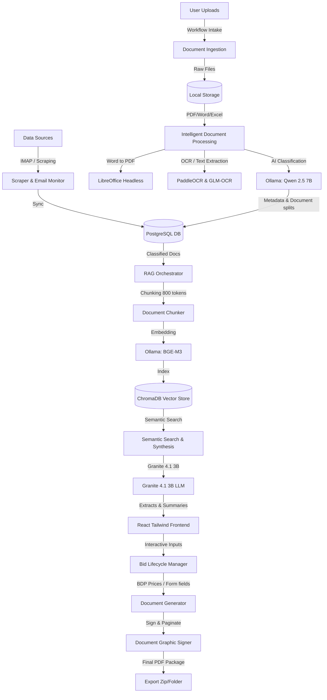

# MarocAO Platform 🇲🇦🤖
> **Intelligent Public Procurement Bid Assistant for Moroccan Appels d'Offres (AO)**

MarocAO is an end-to-end, locally hosted Intelligent Document Processing (IDP) and Retrieval-Augmented Generation (RAG) platform designed to automate the lifecycle of public procurement bid preparation in Morocco. By combining local Large Language Models (LLMs), OCR vision engines, vector databases, and automated document generation pipelines, the platform simplifies the complex task of organizing, analyzing, filling, signing, and packaging bid submission folders (*Dossier d'Appel d'Offres* - DAO).

---

## 🏗️ Core Architecture & Technology Stack

The platform is designed to run entirely **on-premise / locally** to guarantee document confidentiality.



### 🧱 Technology Summary
* **Backend**: FastAPI (Python 3.13), SQLAlchemy ORM, PostgreSQL database, Alembic migrations, and APScheduler for cron telemetry.
* **Frontend**: React 19, Vite, Tailwind CSS, React Router v7, Three.js (for Vector Visualization), and Plotly.js.
* **Local AI Orchestration (Ollama)**:
  * **Document Classification**: `qwen2.5:7b` (Robust reasoning for French legal/technical terminology).
  * **OCR Vision**: `glm-ocr` (Accurate text extraction from scanned documents).
  * **Embeddings**: `bge-m3:latest` (Multilingual embedding model).
  * **RAG Synthesis**: `granite4.1:3b` (Efficient local model for business summaries).
* **Document Processing Tools**:
  * **OCR**: PaddleOCR ONNX Runtime & PyMuPDF (fitz).
  * **Office Converters**: Headless LibreOffice (`soffice.exe`) for `.docx` and `.xlsx` to PDF conversions.
  * **Signer**: ReportLab & PyPDF-based graphical signature overlay.
  * **Automation**: Selenium Standalone Chrome container for tender portal scraping.
  * **Vector DB**: ChromaDB.

---

## 🌟 Key Features

1. **Tender Scraping & Alert Sync**:
   * Automated Selenium scraper for the Moroccan Public Procurement Portal (*Portail des Marchés Publics*).
   * Email Monitor fetching tender alerts via IMAP protocol (`imap.gmail.com`) for PMMP updates.
   * Real-time pipeline log streaming via WebSockets.
   * Automated Excel export/import system to synchronize tender lists with offline trackers.
2. **Intelligent Document Ingestion & Page-Splitting**:
   * OCR text extraction for scanned PDF/image documents.
   * Automated categorization of files into: RC (*Règlement de Consultation*), CPS (*Cahier des Prescriptions Spéciales*), BDP (*Bordereau des Prix*), Acte d'Engagement, etc.
   * Manual and AI-driven page-splitting: Upload a single combined tender document, define split ranges, and automatically generate distinct sub-documents.
3. **Retrieval-Augmented Generation (RAG) Engine**:
   * Context-aware chunking and semantic indexing.
   * Natural language query interface to ask specific questions about tender requirements.
   * Multi-category retrieval (financial guarantees, deadlines, delay penalties, evaluation criteria).
4. **Bid Lifecycle Workflow Manager (DAO)**:
   * A step-by-step guided manager implementing a 6-stage lifecycle:
     1. **Preparation**: Scan, run OCR, build document inventory.
     2. **Validation**: Human verification, manual classification override, document splitting.
     3. **BDP (Bordereau des Prix)**: Automatic extraction of items/articles; interactive unit price filler; auto-calculation of totals.
     4. **Administrative Acts**: Dynamic field extraction and generation for forms like *Acte d'Engagement* and *Déclaration sur l'Honneur*.
     5. **Signature**: Automated page numbering and insertion of visual signature blocks onto designated RC/CPS zones.
     6. **Finalization**: LibreOffice to PDF conversion, file integrity verification, and final ZIP packaging.
5. **Interactive Embeddings Vector Visualizer**:
   * Real-time 2D and 3D visualization of the ChromaDB vector database using PCA or t-SNE coordinate reductions (Three.js and Plotly.js).
6. **Telemetry & Audit Dashboards**:
   * Real-time hardware and AI telemetry tracking (CPU/VRAM/Database metrics).
   * AI accuracy tracking: Compares model predictions against human validations to output real-time accuracy rates.

---

## 📂 Project Directory Layout

```text
marocao-platform/
├── backend/
│   ├── app/
│   │   ├── auth/                # JWT Auth, security managers, and user routes
│   │   ├── database/            # SQLAlchemy connection and schemas
│   │   ├── modules/
│   │   │   ├── ai_processor/    # IDP, OCR (PaddleOCR), and Few-shot Engine
│   │   │   ├── audit/           # Accuracy calculation and human correction audits
│   │   │   ├── rag_engine/      # Chunking, Embeddings, Chroma, and QA routes
│   │   │   ├── scraper/         # IMAP mail listener & Selenium portal scraper
│   │   │   ├── telemetry/       # System metrics & Background scheduler
│   │   │   ├── tenders/         # CRUD for tender notices and bidding metadata
│   │   │   └── workflows/       # 6-step Bid Folder Lifecycle engine
│   │   ├── config.py            # Global project config & Pydantic settings
│   │   └── main.py              # Main FastAPI application & startup cron setup
│   └── data_storage/            # Persisted ChromaDB, uploads, and final templates
├── frontend/
│   ├── src/
│   │   ├── components/
│   │   │   ├── admin/           # Intelligence configurations, user & vector visualizer
│   │   │   ├── auth/            # Authentications views
│   │   │   ├── classifier/      # Documents validator & splits
│   │   │   ├── dashboard/       # Telemetry, RAG & Audit logs dashboards
│   │   │   ├── rag/             # Global & specific RAG search interfaces
│   │   │   └── workflow/        # 6 steps of the Bid lifecycle wizard
│   │   ├── layouts/             # Sidebar and standard page grid layouts
│   │   ├── services/            # Axios API wrappers
│   │   ├── App.jsx              # Routing configurations
│   │   └── main.jsx             # Entrypoint
│   ├── index.html
│   ├── tailwind.config.js
│   └── vite.config.js
├── docker-compose.yml           # Runs headless Standalone Selenium Chrome
├── pyproject.toml               # Python dependencies (Paddle, Torch, FastAPI)
└── uv.lock                      # Locked dependency tree
```

---

## 🛠️ Installation & Setup

### Prerequisites
* **Operating System**: Windows (configured for local paths), but adaptable to Linux/macOS.
* **Python**: `Version >= 3.13`
* **Node.js**: `Version >= 18.x`
* **PostgreSQL**: Local or remote instance.
* **Ollama**: Installed and running locally (`http://localhost:11434`).
* **LibreOffice**: Installed locally (required for document conversions). Default path: `C:\Program Files\LibreOffice\program\soffice.exe`.

### 1. Database Setup
Create a PostgreSQL database named `marocao_db`:
```sql
CREATE DATABASE marocao_db;
```

### 2. Ollama Model Setup
Download the required LLM and Embedding models on your local machine:
```bash
# General Classification and Reasoning Model
ollama pull qwen2.5:7b

# OCR Text Extraction Model
ollama pull glm-ocr:latest

# Document Synthesis / RAG Generator
ollama pull granite4.1:3b

# Multilingual Text Embeddings
ollama pull bge-m3:latest
```

### 3. Environment Configuration
Create a `.env` file at the project root by copying configurations from the example below. Make sure to update the credentials for email scraping (IMAP) and PostgreSQL connection:
* See: [.env](file:///c:/Users/achra/Desktop/Intern/Project/marocao-platform/.env)

```env
DATABASE_URL=postgresql://postgres:<password>@localhost:5432/marocao_db
JWT_SECRET=660eb61a452a805f6953b685808923258c7389f80736cdd41dabbcb04e2dbb48
JWT_ALGORITHM=HS256

ADMIN_FIRST_EMAIL=admin@marocao.ma
ADMIN_FIRST_PASSWORD=MotDePasseSecurise2026!

# Email Scraper IMAP (Gmail requires App Password)
EMAIL_USER=your_email@gmail.com
EMAIL_PASSWORD=your_app_password
EMAIL_IMAP_SERVER=imap.gmail.com

# Ollama Infrastructure
OLLAMA_BASE_URL=http://localhost:11434
OLLAMA_MODEL=qwen2.5:7b
MODEL_VISION_OCR=glm-ocr:latest
MODEL_RAG_ANALYSIS=granite4.1:3b
MODEL_EMBEDDINGS=bge-m3:latest
OLLAMA_KEEP_ALIVE=0

# Persisted Storage directories
CHROMA_PERSIST_DIR=data_storage/chroma_db
DATA_STORAGE_PATH=C:\Users\achra\Desktop\Intern\Project\marocao-platform\data_storage
```

---

## 🚀 Running the Application

### Step 1: Start Selenium Standalone Chrome
Launch the headless browser container using Docker Compose. This container will handle background scraping and is linked directly to your local file system:
```bash
docker-compose up -d
```
> [!NOTE]
> You can view the live execution of Selenium Chrome in your browser at `http://localhost:7900/?password=secret` (useful to debug captcha or page loads).

### Step 2: Backend Setup & Execution
Run database migrations and start the FastAPI backend server:
```bash
# 1. Run migrations using Alembic
alembic upgrade head

# 2. Run the FastAPI development server
uvicorn backend.app.main:app --reload --port 8000
```
> [!TIP]
> On startup, the backend automatically seeds the initial admin account (`admin@marocao.ma`) and initiates a sync of local tenders and PMMP emails.

### Step 3: Frontend Setup & Execution
Navigate to the frontend folder, install packages, and boot up Vite:
```bash
cd frontend
npm install
npm run dev
```
Open your browser and navigate to `http://localhost:5173`. Use the initial administrator credentials to log in.

---

## 📈 System Telemetry & AI Fine-Tuning

### Few-Shot Learning Interface
To improve document classification accuracy over time, MarocAO includes a reinforcement pipeline:
1. When a user corrects a document type (e.g., correcting an AI output of `CPS` to `RC`), a validation audit log is saved in the database.
2. The **Few-Shot Engine** extracts these corrections and embeds them dynamically into the system classification prompts.
3. You can export the corrected dataset in Google Colab JSONL format (`waraq_dataset.jsonl`) via the **Admin Intelligence Engine** for advanced model fine-tuning.

---

## 🔗 Related Resources

* API Entrypoint: [backend/app/main.py](file:///c:/Users/achra/Desktop/Intern/Project/marocao-platform/backend/app/main.py)
* Database Connection: [backend/app/database/connection.py](file:///c:/Users/achra/Desktop/Intern/Project/marocao-platform/backend/app/database/connection.py)
* Bid Generation Workflow: [backend/app/modules/workflows/routes.py](file:///c:/Users/achra/Desktop/Intern/Project/marocao-platform/backend/app/modules/workflows/routes.py)
* Frontend Router: [frontend/src/App.jsx](file:///c:/Users/achra/Desktop/Intern/Project/marocao-platform/frontend/src/App.jsx)
* Config Settings: [backend/app/config.py](file:///c:/Users/achra/Desktop/Intern/Project/marocao-platform/backend/app/config.py)
