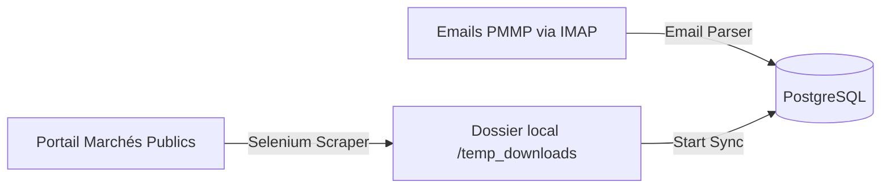

# Guide d'Utilisation de la Plateforme MarocAO 🇲🇦🤖
> **Manuel d'utilisation pour la préparation et l'analyse automatisées des Dossiers d'Appel d'Offres (DAO) marocains.**

Bienvenue dans le Guide d'Utilisation officiel de **MarocAO**, votre assistant intelligent basé sur l'Intelligence Artificielle Locale pour simplifier et optimiser la soumission aux marchés publics au Maroc.

---

## 📋 Table des Matières
1. [Introduction & Accès à la Plateforme](#1-introduction--accès-à-la-plateforme)
2. [Rôles et Gestion des Utilisateurs](#2-rôles-et-gestion-des-utilisateurs)
3. [Le Tableau de Bord & la Télémétrie](#3-le-tableau-de-bord--la-télémétrie)
4. [La Gestion des Appels d'Offres (Tenders)](#4-la-gestion-des-appels-doffres-tenders)
5. [Le Pipeline de Scraping et de Synchronisation](#5-le-pipeline-de-scraping-et-de-synchronisation)
6. [Le Cycle de Production du Dossier de Soumission (DAO)](#6-le-cycle-de-production-du-dossier-de-soumission-dao)
   - [Étape 1 : Préparation & Scan](#étape-1--préparation--scan)
   - [Étape 2 : Validation Manuelle](#étape-2--validation-manuelle)
   - [Étape 3 : Bordereau des Prix (BDP)](#étape-3--bordereau-des-prix-bdp)
   - [Étape 4 : Actes / Administratif](#étape-4--actes--administratif)
   - [Étape 5 : Signature Graphique](#étape-5--signature-graphique)
   - [Étape 6 : Finalisation & Packaging](#étape-6--finalisation--packaging)
7. [Moteur RAG (Recherche Sémantique) & Questions/Réponses](#7-moteur-rag-recherche-sémantique--questionsréponses)
8. [Moteur d'Apprentissage Few-Shot (Waraq Intelligence Engine)](#8-moteur-dapprentissage-few-shot-waraq-intelligence-engine)
9. [Visualisation Tridimensionnelle des Vecteurs (ChromaDB)](#9-visualisation-tridimensionnelle-des-vecteurs-chromadb)
10. [Dépannage & FAQ](#10-dépannage--faq)

---

## 1. Introduction & Accès à la Plateforme

La plateforme **MarocAO** permet aux entreprises soumissionnaires de traiter de grands volumes de documents techniques, administratifs et financiers de manière sécurisée et locale. 

### Comment y accéder ?
1. Ouvrez votre navigateur internet et naviguez vers l'adresse locale du frontend : `http://localhost:5173`.
2. Connectez-vous en utilisant vos identifiants. Si vous utilisez l'application pour la première fois, connectez-vous avec le compte administrateur par défaut :
   * **Email** : `admin@marocao.ma`
   * **Mot de passe** : `MotDePasseSecurise2026!` *(Modifiable immédiatement dans votre profil)*.
3. Si vous n'avez pas de compte, utilisez la page **S'enregistrer** (*Register*) qui vous guidera dans la création de compte en deux étapes :
   * **Étape 1** : Création des identifiants (Email et mot de passe).
   * **Étape 2** : Configuration du profil (Nom de l'entreprise, coordonnées de contact, ICE, RC, etc.).

---

## 2. Rôles et Gestion des Utilisateurs

L'application intègre un contrôle d'accès basé sur les rôles (RBAC) :
* **Candidat** : Peut parcourir les appels d'offres, lancer le cycle de génération d'un dossier de soumission pour ses projets, utiliser la recherche RAG pour poser des questions sur les pièces d'un marché public.
* **Administrateur** : A accès à toutes les fonctionnalités des Candidats, plus :
  * La gestion des comptes utilisateurs (activation, modification des rôles).
  * Le pilotage et la planification du Scraper/Pipeline de synchronisation.
  * Les statistiques de performance et de télémétrie des modèles d'IA.
  * La configuration avancée du moteur de Few-Shot learning (Waraq Intelligence Engine).

---

## 3. Le Tableau de Bord & la Télémétrie

Dès votre connexion, le **Tableau de Bord** vous présente un aperçu synthétique de l'activité :

### Indicateurs Clés
* **Total Tenders** : Nombre d'offres enregistrées dans la base de données.
* **Total Documents** : Nombre total de fichiers de pièces importés et traités.
* **Taux d'Exactitude de l'IA (AI Accuracy)** : Pourcentage de classifications correctes calculé dynamiquement en comparant les prédictions initiales de l'IA (Qwen2.5) avec les validations/corrections manuelles effectuées par les utilisateurs.

### Onglets de Supervision technique (Admins)
1. **Telemetry Dashboard** :
   * Affiche l'historique des snapshots matériels et systèmes (charge CPU, utilisation de la RAM, volume des bases SQL/ChromaDB).
   * Suivi du temps de calcul moyen de l'OCR et des LLM. Un bouton **"Collecter les métriques"** permet de forcer un snapshot immédiat.
2. **Audit Logs** :
   * Historique chronologique complet des corrections de types de pièces faites par l'humain. 
   * Permet de suivre quel document a été corrigé, sa catégorie d'origine estimée par l'IA et le type final validé.
3. **RAG Logs** :
   * Visualisation détaillée des logs du pipeline d'indexation vectorielle. Indique les étapes de découpage en fragments (*chunks*), de génération d'embeddings et de stockage dans ChromaDB.

---

## 4. La Gestion des Appels d'Offres (Tenders)

Dans l'onglet **Appels d'Offres** (*Tenders*), vous disposez de deux vues principales :
* **Vue Simplifiée (Minimal)** : Un tableau optimisé affichant les informations prioritaires (Référence de la consultation, Objet/Titre, Organisme Acheteur, Date limite de dépôt, Catégorie).
* **Vue Détaillée (Full List)** : Permet de filtrer finement la liste par statut de consultation, par catégorie d'activité (ex: Travaux, Fournitures), ou par date d'extraction en base.

En cliquant sur une offre spécifique, vous accédez à sa **Fiche Détail** :
* **Informations Générales** : Budget estimé, coordonnées de contact, lots concernés.
* **Pièces Jointes** : Liste de tous les documents associés téléchargés.
* **Bouton Workflow** : Permet de démarrer la préparation du dossier de soumission pour cette offre précise.

---

## 5. Le Pipeline de Scraping et de Synchronisation

Situé dans la section **Scraper Manager**, cette page est le centre névralgique de collecte de données. Elle propose trois modes d'importation :

1. **Scraping du Portail** : Lance un script Selenium en arrière-plan (exécuté dans le conteneur Chrome Standalone Docker) pour collecter les avis de marchés publics récents et télécharger les pièces de consultation associées.
2. **Synchronisation Locale** : Scanne le répertoire local `data_storage` et importe en base de données les nouvelles offres et les fichiers PDF/Word physiques.
3. **Synchronisation d'Emails** : Se connecte via IMAP à la messagerie configurée pour extraire les e-mails d'alertes du Portail Marocain des Marchés Publics. Les notifications reçues apparaissent sous forme de cartes d'alertes dans le volet d'administration.
4. **Export Excel** : Génère ou met à jour le fichier global `tenders_export.xlsx` pour permettre une exploitation hors-ligne immédiate.

*Les logs de scraping et d'importation sont streamés en temps réel dans une console interactive via WebSocket.*

---

## 6. Le Cycle de Production du Dossier de Soumission (DAO)

C'est le module principal de l'application (**DAO Workflow Manager**). Il s'articule autour d'un assistant guidé en 6 étapes. Pour commencer, vous devez saisir l'**UUID (identifiant unique) de l'Appel d'Offres** ciblé.

---

### Étape 1 : Préparation & Scan
* **Objectif** : Lancer l'inventaire des pièces de consultation du marché.
* **Fonctionnement** : Cliquez sur **"Lancer le Scan des Documents"**. Le système exécute en arrière-plan le service de conversion (Word vers PDF via LibreOffice headless), extrait le texte par OCR (PaddleOCR ou GLM-OCR) et soumet le texte au modèle `qwen2.5:7b` pour prédire le type de chaque document.
* **Résultat** : Un résumé au format JSON structure et liste les fichiers détectés, leur taille, et leur type d'IA assigné.

---

### Étape 2 : Validation Manuelle
* **Objectif** : Valider ou corriger la classification automatique de l'IA pour garantir un dossier juridiquement propre.
* **Fonctionnement** : Vous voyez un tableau des pièces avec leur nom, leur statut actuel et le type détecté par l'IA.
* **Actions possibles** :
  * **Valider** : Confirme que le type identifié par l'IA est correct.
  * **Invalider / Corriger** : Permet de choisir manuellement la vraie nature du document (ex: changer une pièce de technique à administrative). Le système déplace instantanément le fichier physique dans le bon sous-dossier de stockage.
  * **Découper (Splitting)** : Si un fichier unique volumineux contient à la fois le RC, le CPS et le BDP, vous pouvez saisir des intervalles de pages (ex: Pages 1 à 15 = RC, Pages 16 à 40 = CPS) pour découper et générer automatiquement des sous-fichiers distincts qui rejoindront le workflow.

---

### Étape 3 : Bordereau des Prix (BDP)
* **Objectif** : Automatiser l'extraction et le remplissage financier du BDP.
* **Fonctionnement** :
  1. Cliquez sur **"Analyser le BDP"**. L'IA extrait la liste structurée des articles/prestations avec leur désignation, unité, et quantité.
  2. Un éditeur JSON interactif pré-rempli s'affiche avec la structure extraite.
  3. Renseignez directement les **prix unitaires** dans le JSON.
  4. Cliquez sur **"Remplir et Sauvegarder BDP"**. Le système injecte vos prix, calcule automatiquement les totaux hors taxe et toutes taxes comprises (TTC), et génère le fichier Excel/Word final BDP officiel complété.

---

### Étape 4 : Actes / Administratif
* **Objectif** : Remplir automatiquement les documents administratifs types (*Acte d'Engagement*, *Déclaration sur l'Honneur*).
* **Fonctionnement** :
  1. Saisissez l'ID du document administratif template généré à l'étape 1.
  2. Cliquez sur **"Extraire"**. L'IA analyse le template et génère un formulaire dynamique contenant les champs variables requis (ICE de l'entreprise, Montant caution, Nom du gérant, etc.).
  3. Remplissez le formulaire à l'écran.
  4. Cliquez sur **"Générer le Document Rempli"**. Le système remplace les balises de variables du document Word d'origine et exporte le document administratif final au format PDF.

---

### Étape 5 : Signature Graphique
* **Objectif** : Parapher, paginer et signer numériquement les pièces requises.
* **Fonctionnement** :
  1. Saisissez le **Nom du Signataire** qui sera incrusté sur les documents.
  2. **Option 1 (Globale)** : Cliquez sur **"Tout Signer"**. Le système applique une signature graphique et un tampon sur toutes les pages des documents sensibles (notamment le Règlement de Consultation - RC et le Cahier des Prescriptions Spéciales - CPS) aux emplacements légaux pré-détectés.
  3. **Option 2 (Individuelle)** : Permet de signer un document spécifique en saisissant son UUID.

---

### Étape 6 : Finalisation & Packaging
* **Objectif** : Valider l'intégrité finale du dossier de candidature.
* **Fonctionnement** : Cliquez sur **"Finaliser & Packager le Dossier"**.
* **Résultat** : Le système :
  * Vérifie la présence de toutes les pièces obligatoires validées.
  * Convertit l'ensemble des documents de travail restants en PDF via LibreOffice headless.
  * Génère un fichier ZIP contenant deux répertoires propres : `Dossier_Administratif` et `Dossier_Technique_Financier`, prêt pour la soumission physique ou sur la plateforme des marchés publics.

---

## 7. Moteur RAG (Recherche Sémantique) & Questions/Réponses

L'application intègre un moteur de recherche documentaire intelligent (RAG) dans l'onglet **RAG Viewer** et **RAG Manager** :

### RAG Manager (Indexation)
* Avant de pouvoir interroger un document, celui-ci doit être indexé.
* Dans le **RAG Manager**, vous pouvez sélectionner un document ou un appel d'offres complet et lancer **"Analyser le document RAG"**.
* Le backend va découper le texte, générer les représentations vectorielles via `bge-m3` et les stocker dans **ChromaDB**.

### RAG Viewer & Runner (Questions/Réponses)
* Sélectionnez un document ou un Tender dans l'interface de discussion.
* Saisissez votre question en langage naturel (ex: *"Quel est le montant de la caution provisoire ?"* ou *"Quelles sont les pénalités de retard par jour de dépassement ?"*).
* Le système effectue une recherche sémantique locale dans ChromaDB, extrait les paragraphes les plus pertinents, et les transmet au modèle local **Granite 4.1:3b** qui rédige une réponse précise, sourcée avec les numéros de pages concernés.

---

## 8. Moteur d'Apprentissage Few-Shot (Waraq Intelligence Engine)

Situé dans la section d'administration **Intelligence Engine**, ce module permet de rendre l'IA de classification plus intelligente au fil du temps sans ré-entraînement lourd :

* **Few-Shot Prompt Context** : Affiche les exemples réels de corrections faites par les utilisateurs. Ces exemples sont injectés dynamiquement dans le système de prompt de classification d'Ollama.
* **Dataset Export (Option Colab)** : Exporte toutes les corrections humaines validées sous la forme d'un fichier standard JSON Lines (`waraq_dataset.jsonl`). Ce fichier peut être directement téléversé sur Google Colab pour fine-tuner un modèle de classification personnalisé.
* **Entraînement Local** : Permet de tester le lancement d'un entraînement sur votre machine (requiert un GPU compatible CUDA, sinon renvoie une restriction matérielle propre).

---

## 9. Visualisation Tridimensionnelle des Vecteurs (ChromaDB)

Accessible via **Vector Visualizer**, cette interface avancée offre une représentation spatiale en 3D ou 2D des fragments textuels stockés dans la base vectorielle ChromaDB :

* **Fonctionnement** : Le système applique des algorithmes de réduction de dimensionnalité (**t-SNE** ou **PCA**) sur les vecteurs d'embeddings de dimension 1024 du modèle `bge-m3`.
* **Utilité** : Permet de voir graphiquement comment les documents sont fragmentés. Les points textuels proches sémantiquement se regroupent en clusters géométriques distincts (ex: toutes les clauses de pénalités forment un nuage de points, les montants financiers un autre). Vous pouvez cliquer sur un point pour lire le texte correspondant.

---

## 10. Dépannage & FAQ

### 1. Pourquoi le bouton "Lancer le Scan" renvoie-t-il une erreur "Ollama connection failed" ?
* **Solution** : Vérifiez que l'application Ollama est bien démarrée sur votre machine hôte (`http://localhost:11434`). Assurez-vous d'avoir téléchargé les 4 modèles requis en ligne de commande : `qwen2.5:7b`, `glm-ocr:latest`, `granite4.1:3b` et `bge-m3:latest`.

### 2. Les documents Word (.docx) ne se convertissent pas en PDF dans le workflow.
* **Solution** : Le chemin vers LibreOffice est codé en dur dans la configuration pour pointer vers `C:\Program Files\LibreOffice\program\soffice.exe`. Assurez-vous que LibreOffice est installé à cet emplacement exact sur votre système Windows.

### 3. Le scraper de portail ne démarre pas ou se bloque.
* **Solution** : Assurez-vous que le conteneur Docker `chrome_scraper` est bien en cours d'exécution en saisissant `docker ps` dans votre terminal. Si le site du portail des marchés publics a mis à jour sa sécurité ou ses sélecteurs HTML, le scraper peut nécessiter une mise à jour de ses scripts Selenium.

---

## 🔗 Liens Utiles vers le Projet

* **Point d'entrée de l'API** : [backend/app/main.py](file:///c:/Users/achra/Desktop/Intern/Project/marocao-platform/backend/app/main.py)
* **Configuration générale** : [backend/app/config.py](file:///c:/Users/achra/Desktop/Intern/Project/marocao-platform/backend/app/config.py)
* **Contrôleur de flux DAO** : [backend/app/modules/workflows/routes.py](file:///c:/Users/achra/Desktop/Intern/Project/marocao-platform/backend/app/modules/workflows/routes.py)
* **Interface React Principale** : [frontend/src/App.jsx](file:///c:/Users/achra/Desktop/Intern/Project/marocao-platform/frontend/src/App.jsx)
